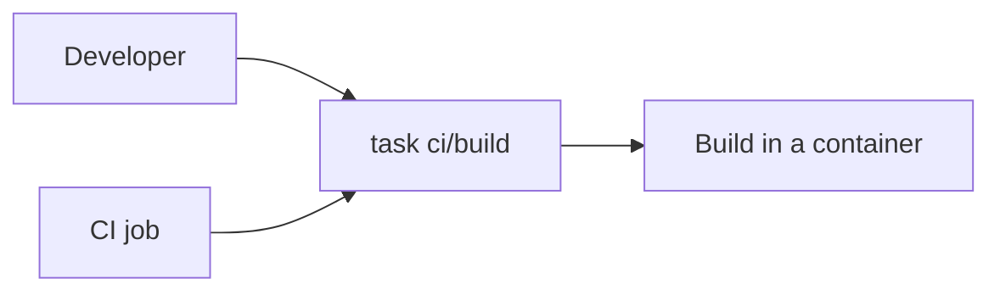
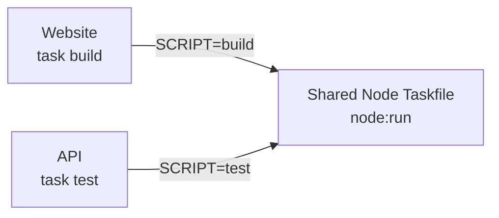
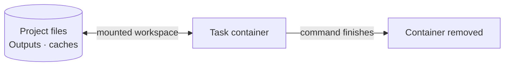

# How Containerized Taskfiles works

Local scripts and CI jobs can describe the same build differently: another tool
version, a missing flag, a different working directory or different environment.

**Keep one project command. Share its execution settings. Package its tools in a container.**

## One task, locally and in CI

Run `task ci/build` on your laptop or CI runner. Both follow the build defined
in your project's Taskfile:

The task defines the image, command, and container settings. Each invocation
runs in its own container. CI supplies the checkout, credentials, and artifact
handling.

## One module, different projects

For example, a website builds its frontend while an API runs its tests.
Both call `node:run` from the same included Taskfile:

Each project keeps its command names, scripts, and image settings. The shared
module handles `npm ci`, script execution, and container setup. Every call runs
in a separate container with that project's files and configured cache.

## Ephemeral runtime, persistent files

Each task runs in a disposable container, while project state remains on the
host:

- **Persistent workspace.** The project is mounted at `/workspace`; source
  files, generated output, and caches survive the container.
- **Host ownership.** The process uses the host UID:GID, preventing generated
  files from becoming root-owned on the developer's machine.
- **Controlled writes.** The project mount is read-write by default and can be
  made read-only for tasks that only inspect files.
- **Explicit access.** Network access can be disabled when unnecessary;
  environment variables, credentials, ports, and additional volumes are passed
  deliberately.
- **Reduced privileges.** The runner drops all Linux capabilities and enables
  `no-new-privileges`. An init process handles signals and child processes.
- **Configurable isolation.** A task can use a writable workspace and network
  when required, or run with read-only files, no network, no forwarded
  credentials, and additional runtime restrictions.

These settings form a configurable execution boundary. They support ordinary
build containers as well as stricter, sandboxed tasks. The actual isolation
guarantees depend on the selected container runtime and host.

## Choose versions deliberately

| Pin                            | Controls                                                                           |
|--------------------------------|------------------------------------------------------------------------------------|
| Task CLI: `3.53.1` baseline    | The task interpreter. Root and included Taskfiles declare the same schema version. |
| Taskfile revision: full commit | The shared commands and container settings.                                        |
| Tool image: tag or digest      | Installed tools and libraries. A digest pins image content.                        |

## What matches, what can differ

| Shared through the task definition       | Still depends on the host or project                 |
|------------------------------------------|------------------------------------------------------|
| Workflow and command arguments           | Source, dependencies, and external services          |
| Selected image reference                 | CPU architecture and platform-specific image content |
| Container paths and mount settings       | Host kernel, runtime, and filesystem behavior        |
| Rules for passing environment and caches | Credential values, network, and cache contents       |

This gives developers a direct way to run the CI command locally. 

[Try it in your project →](README.md#quick-start)
